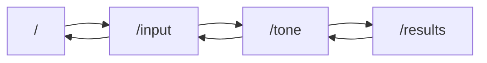

# 项目组件化开发指南

## 1. 文档目的

本文档基于当前仓库 `d:\zuiti` 的实际代码结构整理，目标是让团队成员能够：

- 快速定位页面路由、业务组件、样式文件与数据配置所在位置
- 理解页面、组件、样式之间的真实依赖关系
- 按统一规范新增页面、拆分组件、复用样式与维护交互逻辑
- 在不破坏现有结构的前提下，持续推进组件化开发

## 2. 项目扫描结论

截至当前仓库状态，前端资源结构如下：

- 路由模式：`Next.js App Router`
- 页面路由：4 个
- 全局布局：1 个
- 业务组件：9 个
- 共享数据配置文件：1 个
- 样式文件：13 个
- 公共样式文件：1 个 `app/globals.css`
- 专属样式文件：12 个 `*.module.css`

扫描范围覆盖：

- `app/**/*.tsx`
- `components/*.tsx`
- `components/content.ts`
- `app/globals.css`
- `app/**/*.module.css`
- `components/*.module.css`

当前未发现以下内容：

- `pages/` 目录路由
- `react-router` 或自定义路由配置文件
- 多页面共用的 `styles/` 目录
- 组件样式文件之间的 `@import` / `composes from` 依赖

## 3. 项目组件化架构说明

当前项目采用典型的 App Router + 组件目录分层结构：

### 3.1 目录职责

- `app/`
  - 负责页面路由、布局与页面级样式
  - 页面文件以 `page.tsx` 命名，通过文件系统自动映射到 URL
  - `layout.tsx` 负责全局布局与公共样式注入
- `components/`
  - 负责可复用 UI 组件、局部交互组件、页面基础外壳
  - 当前项目的主要业务组件全部集中于此
- `components/content.ts`
  - 负责页面消费的静态业务数据
  - 当前承载场景卡片、风格卡片、结果卡片的数据源
- `app/globals.css`
  - 负责全局设计令牌、基础元素重置和跨页面复用的全局类
- `*.module.css`
  - 负责页面或组件自己的局部样式，避免样式污染

### 3.2 当前分层原则

- 路由入口放在 `app/`，不在 `components/` 中定义页面
- 页面负责拼装流程，不承载可复用 UI 的具体实现
- 复用组件放在 `components/`，由页面按需组合
- 纯数据与纯展示分离，页面通过 `content.ts` 消费业务配置数据
- 公共视觉能力优先沉淀到 `globals.css` 或稳定复用组件中

### 3.3 资源依赖总图

```mermaid
flowchart TD
  RootLayout["app/layout.tsx"] --> Globals["app/globals.css"]

  Home["app/page.tsx (/ )"] --> HomeCss["app/page.module.css"]
  Home --> MobileShell["components/MobileShell.tsx"]
  Home --> TopBar["components/TopBar.tsx"]
  Home --> DecorativeIcon["components/DecorativeIcon.tsx"]
  Home --> SceneCard["components/SceneCard.tsx"]
  Home --> PrimaryButton["components/PrimaryButton.tsx"]
  Home --> BottomNav["components/BottomNav.tsx"]
  Home --> Content["components/content.ts"]

  Input["app/input/page.tsx (/input)"] --> InputCss["app/input/page.module.css"]
  Input --> MobileShell
  Input --> TopBar
  Input --> StyleCard["components/StyleCard.tsx"]
  Input --> PrimaryButton
  Input --> Content

  Tone["app/tone/page.tsx (/tone)"] --> ToneCss["app/tone/page.module.css"]
  Tone --> MobileShell
  Tone --> TopBar
  Tone --> DecorativeIcon
  Tone --> ToneSlider["components/ToneSlider.tsx"]
  Tone --> PrimaryButton

  Results["app/results/page.tsx (/results)"] --> ResultsCss["app/results/page.module.css"]
  Results --> MobileShell
  Results --> TopBar
  Results --> ResultCard["components/ResultCard.tsx"]
  Results --> Content

  SceneCard --> SceneCardCss["components/SceneCard.module.css"]
  SceneCard --> DecorativeIcon
  StyleCard --> StyleCardCss["components/StyleCard.module.css"]
  StyleCard --> DecorativeIcon
  ToneSlider --> ToneSliderCss["components/ToneSlider.module.css"]
  ResultCard --> ResultCardCss["components/ResultCard.module.css"]
  PrimaryButton --> PrimaryButtonCss["components/PrimaryButton.module.css"]
  TopBar --> TopBarCss["components/TopBar.module.css"]
  MobileShell --> MobileShellCss["components/MobileShell.module.css"]
  BottomNav --> BottomNavCss["components/BottomNav.module.css"]
```

## 4. 路由配置与挂载组件映射

当前项目使用 Next.js App Router，路由由 `app/**/page.tsx` 自动生成，不存在手写路由注册表。

### 4.1 路由清单

| 路由路径 | 页面文件 | 页面职责 | 直接挂载组件 |
| --- | --- | --- | --- |
| `/` | `app/page.tsx` | 首页，展示场景入口并引导进入表达流程 | `MobileShell`、`TopBar`、`DecorativeIcon`、`SceneCard`、`PrimaryButton`、`BottomNav` |
| `/input` | `app/input/page.tsx` | 输入原话并选择风格 | `MobileShell`、`TopBar`、`StyleCard`、`PrimaryButton` |
| `/tone` | `app/tone/page.tsx` | 调整语气参数并预览表达 | `MobileShell`、`TopBar`、`DecorativeIcon`、`ToneSlider`、`PrimaryButton` |
| `/results` | `app/results/page.tsx` | 展示多种改写结果 | `MobileShell`、`TopBar`、`ResultCard` |

### 4.2 页面流程链路

### 4.3 当前页面跳转规则

- 首页的 `PrimaryButton` 跳转到 `/input`
- 首页 `SceneCard` 的 4 个场景入口当前都跳转到 `/input`
- 输入页 `TopBar` 返回 `/`
- 输入页 `PrimaryButton` 跳转 `/tone`
- 语气页 `TopBar` 返回 `/input`
- 语气页 `PrimaryButton` 跳转 `/results`
- 结果页 `TopBar` 返回 `/tone`
- `BottomNav` 当前只负责显示底部导航 UI，未绑定真实路由行为

## 5. 组件创建与注册流程

本项目推荐遵循以下标准流程新增组件。

### 5.1 新增复用组件流程

1. 明确组件职责
   - 判断该能力是否会在两个及以上页面或区域复用
   - 若只服务单一路由且复用价值低，优先先放在页面内部或页面专属模块中

2. 确定存储位置
   - 可复用 UI：放到 `components/`
   - 页面路由入口：放到 `app/<route>/page.tsx`
   - 纯数据配置：放到 `components/content.ts` 或后续拆出的数据文件
   - 全局视觉基类：放到 `app/globals.css`

3. 创建组件文件
   - 建议创建 `components/组件名.tsx`
   - 同时创建 `components/组件名.module.css`
   - 组件名使用 PascalCase，例如 `PrimaryButton.tsx`

4. 定义 Props 与导出方式
   - 组件 Props 必须显式声明 TypeScript 类型
   - 可复用组件统一使用具名导出
   - 路由页面与布局文件使用默认导出

5. 接入页面或上层组件
   - 跨目录引用统一优先使用 `@/` 路径别名
   - 同目录依赖使用 `./`
   - 页面只负责组合组件，不直接堆叠过多表现细节

6. 补齐样式与验证
   - 组件专属样式写入 `*.module.css`
   - 仅在确有跨页面复用价值时，把类名沉淀到 `app/globals.css`
   - 验证组件在移动端壳层中是否保持视觉一致性

### 5.2 新增页面流程

1. 在 `app/` 下创建新路由目录，如 `app/profile/`
2. 创建 `app/profile/page.tsx`
3. 如需页面专属样式，创建 `app/profile/page.module.css`
4. 复用已有的 `MobileShell`、`TopBar`、`PrimaryButton` 等基础组件
5. 仅把页面流程相关的结构写入页面文件，把通用块提炼到 `components/`
6. 完成后检查页面是否破坏现有跳转链路与样式范围

### 5.3 何时需要 `use client`

满足以下任一条件时，组件或页面文件需要添加 `"use client"`：

- 使用 React Hook
- 使用 `next/navigation` 的 `useRouter`
- 使用浏览器事件与交互状态
- 使用 `antd-mobile` 这类依赖客户端交互的组件

当前仓库中已使用 `"use client"` 的文件：

- `app/input/page.tsx`
- `components/PrimaryButton.tsx`
- `components/ToneSlider.tsx`
- `components/BottomNav.tsx`

## 6. 编码标准

### 6.1 文件与命名规范

- 路由文件固定使用 `app/**/page.tsx`
- 全局布局固定使用 `app/layout.tsx`
- 复用组件文件使用 PascalCase 命名，例如 `TopBar.tsx`
- 组件专属样式与组件同名，例如 `TopBar.module.css`
- 页面专属样式固定使用 `page.module.css`

### 6.2 导出规范

- 页面组件：默认导出
- 布局组件：默认导出
- 业务组件：具名导出
- 数据常量：具名导出
- 类型定义：与数据或组件就近放置，优先显式导出类型

### 6.3 引用规范

- 跨目录引用统一优先使用 `@/*` 路径别名
- 同目录组件、样式引用使用相对路径 `./`
- 不允许页面之间互相导入页面组件
- 不建议组件直接依赖具体页面文件

### 6.4 组件职责规范

- 页面组件负责页面流程编排
- 基础容器组件负责结构承载，例如 `MobileShell`
- 导航组件负责统一导航呈现，例如 `TopBar`
- 行为组件负责高频交互封装，例如 `PrimaryButton`
- 纯展示组件优先保持无副作用，例如 `ResultCard`
- 纯数据配置与纯展示分离，避免把业务枚举散落在多个组件中

### 6.5 类型与可维护性规范

- 所有组件 Props 必须声明类型
- 布尔型能力使用语义化命名，如 `sparkle`、`active`、`dark`
- 枚举型视觉能力优先使用联合类型，例如 `IconKind`
- 组件文件尽量只做一件事，避免同时承载页面逻辑、数据准备与复杂样式拼装

## 7. 组件样式规范

### 7.1 样式分层原则

- `app/globals.css`
  - 只放全局设计令牌、元素重置、通用视觉类和跨组件复用类
- `app/**/page.module.css`
  - 只放当前页面专属结构与布局样式
- `components/*.module.css`
  - 只放对应组件内部样式

### 7.2 当前全局样式职责

`app/globals.css` 当前承担以下职责：

- 颜色、阴影等设计令牌
- `antd-mobile` 主题变量覆盖
- `html`、`body`、`button`、`textarea`、`a` 等基础样式
- 通用视觉类，例如：
  - `.mobile-shell`
  - `.soft-card`
  - `.primary-button`
  - `.scene-card`
  - `.style-card`
  - `.style-tip`
  - `.result-action`
  - `.action-icon`
  - `.zuiti-icon-*`
  - `.nav-icon-*`

### 7.3 样式书写规则

- 优先使用 CSS Module 承载局部样式
- 只有跨页面、跨组件复用时才新增全局类
- 不在页面样式文件中定义其他组件的专属样式
- 组件样式命名优先贴合语义，如 `container`、`title`、`actions`
- 同一视觉基类若已存在于 `globals.css`，组件内部只补充差异化样式，不重复定义

### 7.4 公共样式与专属样式判定规则

- 公共样式：被全局布局注入，或服务多个页面/组件的通用类
- 专属样式：只由单个页面文件或单个组件文件直接引用的 `*.module.css`

当前扫描结果：

- 公共样式：`app/globals.css`
- 页面专属样式：
  - `app/page.module.css`
  - `app/input/page.module.css`
  - `app/tone/page.module.css`
  - `app/results/page.module.css`
- 组件专属样式：
  - `components/MobileShell.module.css`
  - `components/TopBar.module.css`
  - `components/PrimaryButton.module.css`
  - `components/BottomNav.module.css`
  - `components/SceneCard.module.css`
  - `components/StyleCard.module.css`
  - `components/ToneSlider.module.css`
  - `components/ResultCard.module.css`

## 8. 组件复用规则

### 8.1 推荐复用原则

- 同一结构在 2 个及以上页面重复出现时，应优先提炼组件
- 同一交互能力重复出现时，应优先抽离成独立组件或 Hook
- 同一视觉容器反复出现时，优先沉淀为稳定外壳组件
- 同一业务枚举、列表数据或静态映射，优先沉淀为统一数据文件

### 8.2 当前项目建议复用边界

- `MobileShell`
  - 作为所有移动端页面的统一外壳，应继续复用，不建议各页面自行实现外层壳结构
- `TopBar`
  - 作为所有页面的统一头部，应通过 `title`、`backHref` 扩展，不建议复制头部结构
- `PrimaryButton`
  - 作为统一主按钮，应继续承载主行动按钮样式与跳转能力
- `DecorativeIcon`
  - 作为统一装饰图标渲染层，所有图标型卡片优先复用此组件
- `content.ts`
  - 作为共享业务数据入口，适合继续承载静态场景、风格、结果配置

### 8.3 不建议的做法

- 复制已有页面中的 JSX 结构后直接在新页面堆叠修改
- 在多个页面中重复写同样的按钮、头部、卡片样式
- 在组件中硬编码大量业务数据，导致无法复用
- 为单一组件私有样式直接污染 `globals.css`
- 页面直接依赖另一个页面文件中的内部实现

## 9. 全量组件索引清单

说明：

- “依赖组件”仅统计项目内组件依赖，不包含 `next/link`、`next/navigation`、`antd-mobile` 等三方依赖
- “引用方式”描述当前仓库中的真实导入方式
- “使用场景”用于帮助快速判断是否复用或拆分

### 9.1 页面与布局索引

| 名称 | 存储路径 | 类型 | 功能作用 | 依赖组件 | 样式依赖 | 引用方式 | 使用场景 |
| --- | --- | --- | --- | --- | --- | --- | --- |
| `RootLayout` | `app/layout.tsx` | 全局布局 | 注入全局样式并包裹所有路由页面 | 无 | `app/globals.css` | Next.js 自动加载 | 所有页面公共外层 |
| `Home` | `app/page.tsx` | 路由页面 | 首页，展示场景入口并引导开始表达 | `MobileShell`、`TopBar`、`DecorativeIcon`、`SceneCard`、`PrimaryButton`、`BottomNav` | `app/page.module.css` | App Router 自动挂载为 `/` | 首屏入口 |
| `InputPage` | `app/input/page.tsx` | 路由页面 | 输入原话并选择风格 | `MobileShell`、`TopBar`、`StyleCard`、`PrimaryButton` | `app/input/page.module.css` | App Router 自动挂载为 `/input` | 表达输入与风格选择 |
| `TonePage` | `app/tone/page.tsx` | 路由页面 | 调整语气参数并预览结果 | `MobileShell`、`TopBar`、`DecorativeIcon`、`ToneSlider`、`PrimaryButton` | `app/tone/page.module.css` | App Router 自动挂载为 `/tone` | 语气调节 |
| `ResultsPage` | `app/results/page.tsx` | 路由页面 | 展示改写结果列表 | `MobileShell`、`TopBar`、`ResultCard` | `app/results/page.module.css` | App Router 自动挂载为 `/results` | 结果查看 |

### 9.2 业务组件索引

| 组件名 | 存储路径 | 功能作用 | 依赖组件 | 样式依赖 | 当前引用方 | 引用方式 | 使用场景 |
| --- | --- | --- | --- | --- | --- | --- | --- |
| `MobileShell` | `components/MobileShell.tsx` | 提供统一移动端壳层与内容承载结构 | 无 | `components/MobileShell.module.css` + 全局类 `.mobile-shell` | `app/page.tsx`、`app/input/page.tsx`、`app/tone/page.tsx`、`app/results/page.tsx` | `import { MobileShell } from "@/components/MobileShell";` | 所有页面统一外壳 |
| `TopBar` | `components/TopBar.tsx` | 提供状态栏与可选返回导航栏 | 无 | `components/TopBar.module.css` | `app/page.tsx`、`app/input/page.tsx`、`app/tone/page.tsx`、`app/results/page.tsx` | `import { TopBar } from "@/components/TopBar";` | 页面头部、返回导航 |
| `PrimaryButton` | `components/PrimaryButton.tsx` | 提供统一主行动按钮与路由跳转能力 | 无 | `components/PrimaryButton.module.css` + 全局类 `.primary-button` | `app/page.tsx`、`app/input/page.tsx`、`app/tone/page.tsx` | `import { PrimaryButton } from "@/components/PrimaryButton";` | 主流程推进按钮 |
| `BottomNav` | `components/BottomNav.tsx` | 提供底部 Tab 导航外观 | 无 | `components/BottomNav.module.css` + 全局类 `.nav-icon-*` | `app/page.tsx` | `import { BottomNav } from "@/components/BottomNav";` | 首页底部导航展示 |
| `SceneCard` | `components/SceneCard.tsx` | 展示首页的单个场景入口卡片 | `DecorativeIcon` | `components/SceneCard.module.css` + 全局类 `.scene-card` | `app/page.tsx` | `import { SceneCard } from "@/components/SceneCard";` | 场景入口选择 |
| `StyleCard` | `components/StyleCard.tsx` | 展示输入页的单个风格卡片 | `DecorativeIcon` | `components/StyleCard.module.css` + 全局类 `.style-card`、`.style-tip` | `app/input/page.tsx` | `import { StyleCard } from "@/components/StyleCard";` | 风格选择 |
| `ToneSlider` | `components/ToneSlider.tsx` | 展示语气滑杆卡片与刻度文案 | 无 | `components/ToneSlider.module.css` + 全局类 `.soft-card` | `app/tone/page.tsx` | `import { ToneSlider } from "@/components/ToneSlider";` | 语气维度调节 |
| `ResultCard` | `components/ResultCard.tsx` | 展示改写结果与操作按钮 | 无 | `components/ResultCard.module.css` + 全局类 `.soft-card`、`.result-action`、`.action-icon` | `app/results/page.tsx` | `import { ResultCard } from "@/components/ResultCard";` | 改写结果展示 |
| `DecorativeIcon` | `components/DecorativeIcon.tsx` | 统一渲染装饰性图标形态 | 无 | 依赖 `app/globals.css` 中的 `.zuiti-icon-*` | `app/page.tsx`、`app/tone/page.tsx`、`components/SceneCard.tsx`、`components/StyleCard.tsx` | `import { DecorativeIcon } from "@/components/DecorativeIcon";` 或 `import { DecorativeIcon } from "./DecorativeIcon";` | 场景卡片、风格卡片、页面装饰图标 |

### 9.3 共享数据索引

| 名称 | 存储路径 | 功能作用 | 被谁引用 | 引用方式 | 使用场景 |
| --- | --- | --- | --- | --- | --- |
| `scenes` | `components/content.ts` | 首页场景入口配置 | `app/page.tsx` | `import { scenes } from "@/components/content";` | 场景卡片列表渲染 |
| `styles` | `components/content.ts` | 输入页风格卡片配置 | `app/input/page.tsx` | `import { styles } from "@/components/content";` | 风格卡片列表渲染 |
| `results` | `components/content.ts` | 结果页结果卡片配置 | `app/results/page.tsx` | `import { results } from "@/components/content";` | 结果列表渲染 |
| `IconKind` / `SceneKind` | `components/content.ts` | 图标与场景联合类型 | `DecorativeIcon`、`SceneCard`、`StyleCard` | 同目录或别名导入 | 图标类型约束 |

## 10. 样式资源索引清单

| 样式文件 | 存储路径 | 类型 | 直接引用方 | 关联资源说明 |
| --- | --- | --- | --- | --- |
| `globals.css` | `app/globals.css` | 公共样式 | `app/layout.tsx` | 全局令牌、基础样式、通用类、图标类、导航类 |
| `page.module.css` | `app/page.module.css` | 页面专属样式 | `app/page.tsx` | 首页布局与区块样式 |
| `page.module.css` | `app/input/page.module.css` | 页面专属样式 | `app/input/page.tsx` | 输入页结构、卡片列表、按钮区样式 |
| `page.module.css` | `app/tone/page.module.css` | 页面专属样式 | `app/tone/page.tsx` | 语气页预览区、滑杆区、按钮区样式 |
| `page.module.css` | `app/results/page.module.css` | 页面专属样式 | `app/results/page.tsx` | 结果页文本区与列表区样式 |
| `MobileShell.module.css` | `components/MobileShell.module.css` | 组件专属样式 | `components/MobileShell.tsx` | 页面外壳局部布局样式 |
| `TopBar.module.css` | `components/TopBar.module.css` | 组件专属样式 | `components/TopBar.tsx` | 状态栏与导航栏样式 |
| `PrimaryButton.module.css` | `components/PrimaryButton.module.css` | 组件专属样式 | `components/PrimaryButton.tsx` | 主按钮局部细节与闪光元素样式 |
| `BottomNav.module.css` | `components/BottomNav.module.css` | 组件专属样式 | `components/BottomNav.tsx` | 底部导航布局样式 |
| `SceneCard.module.css` | `components/SceneCard.module.css` | 组件专属样式 | `components/SceneCard.tsx` | 场景卡片标题等局部样式 |
| `StyleCard.module.css` | `components/StyleCard.module.css` | 组件专属样式 | `components/StyleCard.tsx` | 风格卡片标题等局部样式 |
| `ToneSlider.module.css` | `components/ToneSlider.module.css` | 组件专属样式 | `components/ToneSlider.tsx` | 滑杆标题、文案、滑块局部样式 |
| `ResultCard.module.css` | `components/ResultCard.module.css` | 组件专属样式 | `components/ResultCard.tsx` | 结果卡片标签、文本、操作区样式 |

## 11. 新成员上手建议

推荐按以下顺序理解项目：

1. 先看 `app/layout.tsx` 与 `app/globals.css`，理解全局壳层和公共样式能力
2. 再看 4 个页面文件，理解完整业务流程 `/ -> /input -> /tone -> /results`
3. 再看 `components/MobileShell.tsx`、`TopBar.tsx`、`PrimaryButton.tsx`，掌握页面骨架
4. 最后查看 `SceneCard.tsx`、`StyleCard.tsx`、`ToneSlider.tsx`、`ResultCard.tsx` 与 `content.ts`，理解具体业务块

## 12. 后续维护建议

结合当前仓库状态，建议团队后续继续遵循以下维护方向：

- 新页面优先复用 `MobileShell`、`TopBar`、`PrimaryButton`
- 新卡片类结构优先评估是否可以沿用 `soft-card` 全局视觉基类
- 当 `components/content.ts` 继续增长时，可按业务拆分为 `sceneContent.ts`、`styleContent.ts`、`resultContent.ts`
- 当组件数量继续增长时，可按领域拆分子目录，例如 `components/layout/`、`components/cards/`、`components/forms/`
- 若 `BottomNav` 后续接入真实导航，应统一补齐路由映射与激活态规则，并同步更新本文档

---

文档维护原则：

- 每次新增页面、组件、共享数据或样式文件后，应同步更新本文档
- 若组件职责、引用关系或样式归属发生变化，应优先更新“全量组件索引清单”和“样式资源索引清单”
- 若路由链路调整，应优先更新“路由配置与挂载组件映射”
